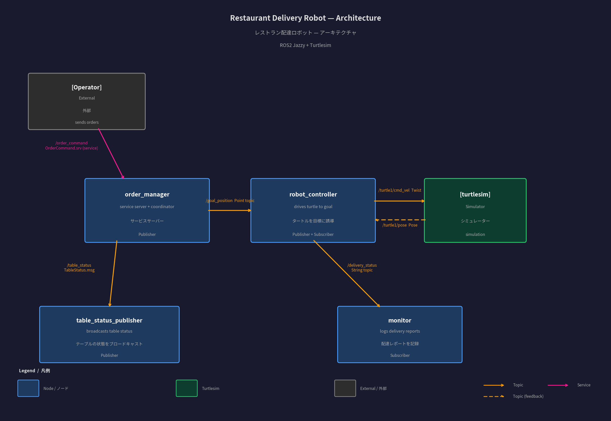
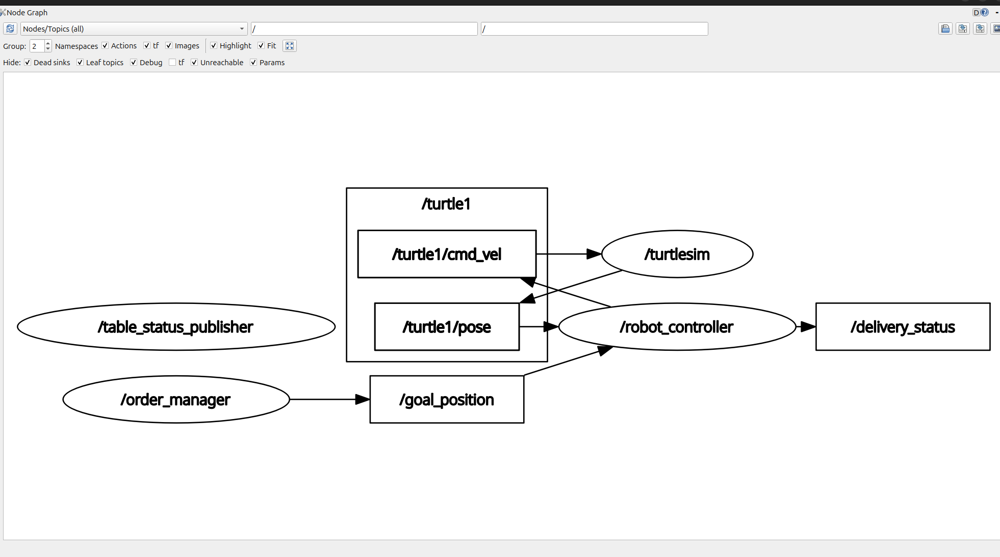

# ROS2 Restaurant Delivery Robot Demo
# ROS2 レストラン配達ロボット デモ

[](https://docs.ros.org/en/jazzy/)
[](https://www.python.org/)
[](LICENSE)

A ROS2-based restaurant delivery robot simulation built with Turtlesim.  
Turtlesimを使用したROS2ベースのレストラン配達ロボットシミュレーション。

---

## Demo / デモ

> Launch the system and send an order — the turtle navigates to the table automatically.  
> システムを起動して注文を送信すると、タートルが自動でテーブルに向かいます。


---

## Architecture / アーキテクチャ



| Node | Role (EN) | 役割 (JP) |
|------|-----------|-----------|
| `order_manager` | Receives orders via service, publishes goal position | サービスで注文を受け、目標座標を配信 |
| `robot_controller` | Drives turtle to goal, reports delivery | タートルを目標に誘導し、配達を報告 |
| `table_status_publisher` | Broadcasts table occupancy status | テーブルの状態をブロードキャスト |
| `monitor` | Subscribes to delivery status, logs reports | 配達状況を受信してログに記録 |

### ROS2 Graph / ROS2グラフ



---

## Topics & Services / トピックとサービス

| Type | Name | Message Type | Description / 説明 |
|------|------|--------------|--------------------|
| Service | `/order_command` | `OrderCommand.srv` | Send order / 注文送信 |
| Topic | `/goal_position` | `geometry_msgs/Point` | Target coordinates / 目標座標 |
| Topic | `/table_status` | `TableStatus.msg` | Table status / テーブル状態 |
| Topic | `/delivery_status` | `std_msgs/String` | Delivery report / 配達報告 |
| Topic | `/turtle1/cmd_vel` | `geometry_msgs/Twist` | Turtle velocity / 速度指令 |
| Topic | `/turtle1/pose` | `turtlesim/Pose` | Turtle position / 現在位置 |

---

## Requirements / 必要環境

- Ubuntu 24.04 LTS
- ROS2 Jazzy Desktop
- Turtlesim (`ros-jazzy-turtlesim`)
- Python 3.12

---

## Build & Run / ビルドと実行

### 1. Clone & Build / クローンとビルド

```bash
git clone https://github.com/AhmetEsme/ros2-restaurant-robot-demo.git
cd ros2-restaurant-robot-demo
colcon build
source install/setup.bash
```

### 2. Launch All Nodes / 全ノード起動

```bash
ros2 launch restaurant_robot restaurant.launch.py
```

This starts Turtlesim + all 4 nodes with parameters loaded automatically.  
Turtlesimと4つのノードがパラメータ付きで自動起動します。

### 3. Send an Order / 注文を送信

```bash
ros2 service call /order_command restaurant_robot_interfaces/srv/OrderCommand \
  "{command: 'add_order', table_number: 1}"
```

Available tables / 利用可能なテーブル:

| Table / テーブル | Coordinates / 座標 |
|------------------|--------------------|
| 1 | (2.0, 2.0) |
| 2 | (5.0, 5.0) |
| 3 | (8.0, 8.0) |

### 4. Monitor Deliveries / 配達状況の監視

```bash
ros2 topic echo /delivery_status
```

---

## Package Structure / パッケージ構成

```
restaurant_robot_ws/
├── src/
│   ├── restaurant_robot/              # Main package / メインパッケージ
│   │   ├── restaurant_robot/
│   │   │   ├── robot_controller.py    # Drives turtle / タートル制御
│   │   │   ├── order_manager.py       # Order service / 注文サービス
│   │   │   ├── table_status_publisher.py
│   │   │   └── monitor.py             # Delivery logger / 配達ログ
│   │   ├── config/
│   │   │   └── params.yaml            # Table coordinates / テーブル座標
│   │   └── launch/
│   │       └── restaurant.launch.py
│   └── restaurant_robot_interfaces/   # Custom msg/srv / カスタムメッセージ
│       ├── srv/OrderCommand.srv
│       └── msg/TableStatus.msg
└── docs/
    ├── architecture.png
    └── rqt_graph.png
```

---

## Custom Interfaces / カスタムインターフェース

**OrderCommand.srv**
```
string command      # 'add_order' / '注文追加'
int32 table_number  # Table number / テーブル番号
---
bool success
string message
```

**TableStatus.msg**
```
int32 table_number   # Table number / テーブル番号
string status        # EMPTY / WAITING / DELIVERED
```

---

## Table Coordinates / テーブル座標の設定

Edit `config/params.yaml` to change table positions:  
テーブルの座標は `config/params.yaml` で変更できます：

```yaml
order_manager:
  ros__parameters:
    table_x_coords: [2.0, 5.0, 8.0]
    table_y_coords: [2.0, 5.0, 8.0]
```

---

## Tech Stack / 使用技術

| Technology | Version | Role / 役割 |
|-----------|---------|-------------|
| ROS2 Jazzy | 2024 | Robot middleware / ロボットミドルウェア |
| Python | 3.12 | Node implementation / ノード実装 |
| Turtlesim | - | 2D simulation / 2Dシミュレーション |
| Ubuntu | 24.04 | Operating system / OS |

---

*Built for tech fair demo — June 2026 / 技術展示会デモ用 — 2026年6月*
